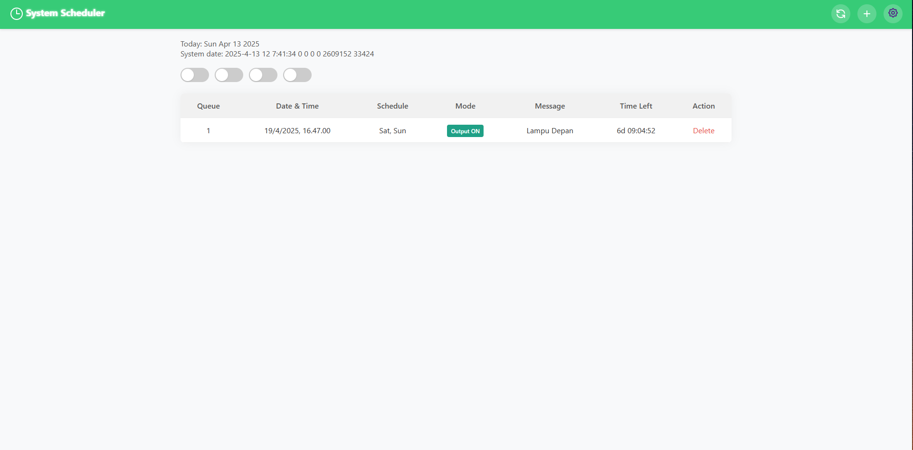
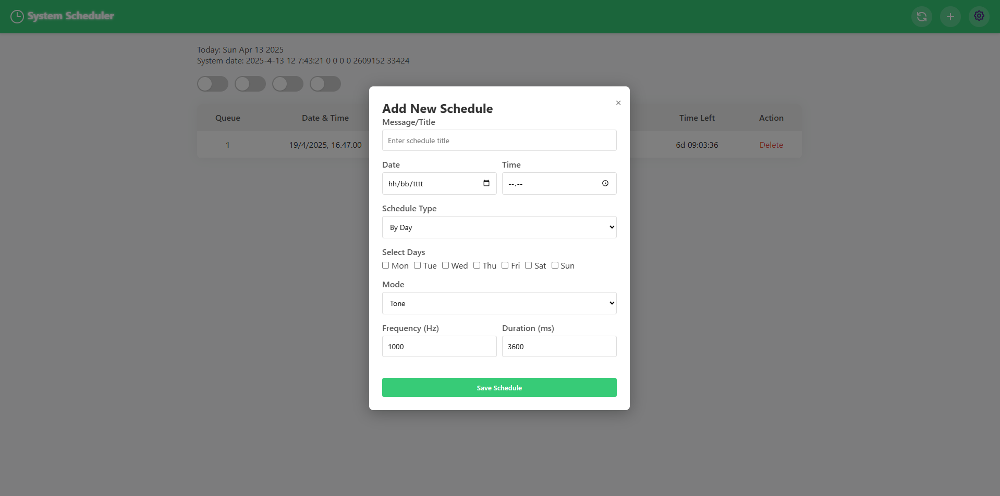

# ⏰ System Scheduler

**System Scheduler** adalah aplikasi berbasis mikrokontroler esp8266 yang memungkinkan pengguna untuk menjadwalkan aktivitas tertentu secara otomatis berdasarkan tanggal, waktu, dan mode yang ditentukan. Program EPS8266 ini dapat digunakan untuk mengontrol perangkat, mengaktifkan output seperti tone/buzzer.

---

## 🚀 Fitur Utama

- 📆 **Penjadwalan Otomatis**
  - Jadwalkan aksi secara harian atau berdasarkan tanggal tertentu.
  - Dukungan multi-jadwal dengan sistem antrian.

- 🔔 **Mode Eksekusi**
  - `Output ON/OFF`: Menyalakan atau mematikan perangkat.
  - `Tone`: Mengaktifkan suara buzzer dengan durasi dan frekuensi tertentu.

- 📋 **Pengelolaan Jadwal**
  - Tambah, lihat, dan hapus jadwal dengan mudah.
  - Hitung waktu mundur (`Time Left`) menuju aksi terjadwal.

- 📱 **User Interface Modern**
  - Desain UI bersih, responsif, dan intuitif.
  - Kompatibel untuk desktop & tablet.

---

## 🖼️ Tampilan Antarmuka

### 1. Dashboard Scheduler

Menampilkan daftar semua jadwal aktif beserta statusnya:

| Kolom         | Deskripsi |
|---------------|-----------|
| Queue         | Nomor antrian jadwal |
| Date & Time   | Waktu eksekusi |
| Schedule      | Hari terjadwal |
| Mode          | Mode yang digunakan (Output ON/OFF atau Tone) |
| Message       | Deskripsi atau nama perangkat |
| Time Left     | Waktu tersisa menuju eksekusi |
| Action        | Hapus jadwal |

---

### 2. Form Tambah Jadwal

Form ini digunakan untuk membuat jadwal baru dengan berbagai parameter:

| Parameter           | Deskripsi |
|---------------------|-----------|
| Message/Title       | Nama atau deskripsi dari jadwal |
| Date & Time         | Waktu spesifik untuk menjalankan aksi |
| Schedule Type       | Tipe penjadwalan: `By Day` |
| Select Days         | Hari-hari aktif untuk jadwal (`Mon` - `Sun`) |
| Mode                | Mode eksekusi (`Tone` / `Output ON/OFF`) |
| Frequency & Duration| Jika mode `Tone`, tentukan frekuensi (Hz) dan durasi (ms) |

---

## 🛠️ Teknologi yang Digunakan

- **Frontend**: HTML, CSS, JavaScript
- **Backend**: ESP32 
- **Database**: EEPROM, littlefs
- **Other**: Real-time Clock / millis() / Tone Generator / Relay Driver

---

## 📦 Instalasi & Deploy

### ⚙️ Cara Build dan Upload
- Buka project ini di platformIO
- Pilih board NodeMCU 1.0 (ESP-12E Module) atau board ESP8266 lainnya
- Upload sketch via kabel USB
- Akses halaman lokal atau konfigurasi WiFi jika SSID tidak ditemukan

---

🌐 Akses Web Localhost

Mode STA (tersambung ke WiFi):

Buka http://<ESP_IP_ADDRESS>/

Mode CONFIG (SoftAP):

Sambungkan ke WiFi [CONFIG MODE], lalu buka http://192.168.4.1/

---

📌 Catatan
- Semua jadwal akan diperiksa setiap detik
- Jadwal akan diperbarui otomatis setiap 7 hari
- Jadwal yang sudah lewat lebih dari 10 detik akan dihapus

---

🧑‍💻 Dibuat oleh
Muhamad Bekti Wibowo
🧰 Teknik Elektro, 🔌 Embedded Systems, 🌐 Web Integration

📅 Tahun 2025
